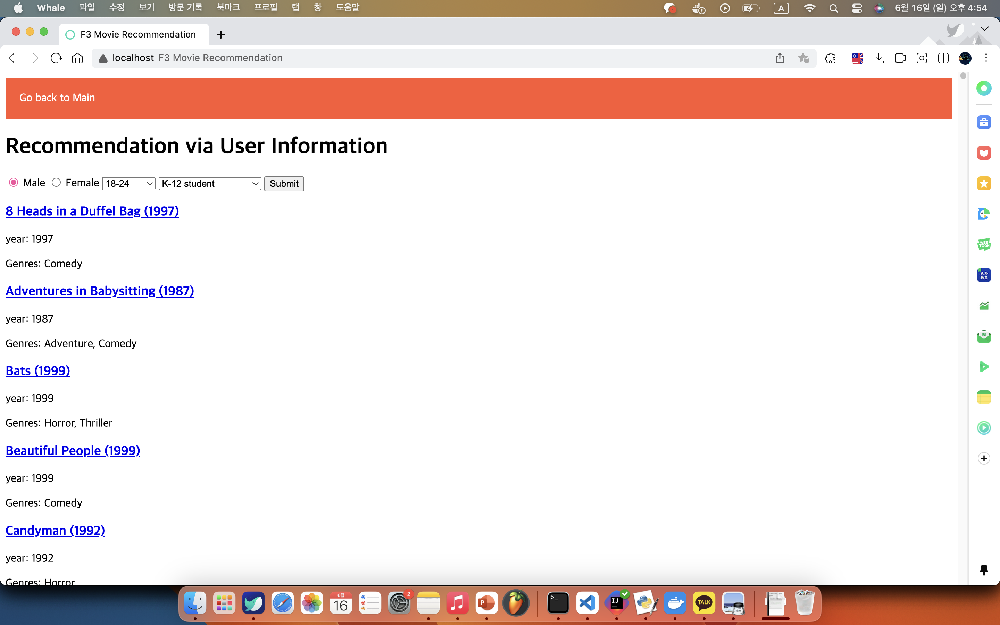
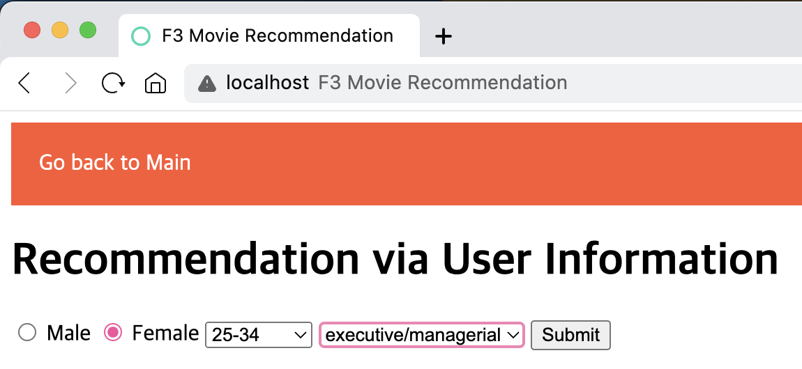

# FreshTomatoes


<!--  {width=600} -->

We present you... **FreshTomatoes**!

A web application with movie services

## Getting Started

These instructions will get you a copy of the project up and running on your local machine for development and testing purposes. See deployment for notes on how to deploy the project on a live system.

### Prerequisites

- Git (https://git-scm.com/book/en/v2/Getting-Started-Installing-Git)
- Docker Desktop (https://www.docker.com/products/docker-desktop/)

### Installing

1. Download our repository. ( `git clone https://github.com/cse364-unist/projects-group3.git` )
2. For running, start up the Docker Desktop.


## Key Features

### 1. ChatGPT based movie search engine

#### 1.1. Function

(what does it do?)

#### 1.2. Usage

(how to use it? - input (including urls... - which one?)+output+examples of the frontend!)

#### 1.3. REST APIs

(기존 ms2의 input, output, example curl commands 등)

### 2. (Feature 2 제목)

...

### 3. Recommendation via User Information

#### 3.1. Function

Basically, given website user information, it recommends movies based on the ratings of similar people.

#### 3.2. Usage

##### 3.2.1. Input
1. Access http://localhost:8080/rec
2. Input the gender, age, and occupation of a person.

##### 3.2.2. Output
The list of movies with links to the duckduckgo search result pops up, ordered in the way that the prior ones are recommended. Specifically,

 1. Average rating (based on the ratings made by the specific type of user): monotonically decreasing
 2. Number of reviews: monotonically decreasing
 3. Title of movie: lexicographically



#### 3.3. Use Cases

- Imagine that you have a girlfriend or a boyfriend (in the future). You can type in the gender, age, and occupation of your lover and watch movies that they likely to have watched and enjoyed. Therefore, you can make a connection with the person via movies.

##### 3.3.1. Example Usage Demonstration

Assume that you have a girlfriend with the following information:

	Yuri.
	Female, 26, Founder of tomato.org

Then, you can use this website to guess which movie she likes.

You type in the gender, age, and occupation information like this:



then you can see the list of movies recommended like this:


With this, you can watch the movies `about Time`, `Equilibrium`, and `Cute Bear` and can make a connection with her later. If she didn’t watch it, you could ask for watching it together! :3

#### 3.4. REST APIs

For this feature, there is only one REST API: recByUser.

```java
@GetMapping(value = "user", params = {"gender", "age", "occ"})
public ResponseEntity<?> recByUser(
      @RequestParam("gender") String gender,
      @RequestParam(value = "age", required = true) Long age,
      @RequestParam("occ") Long occ)
```

Given user information, this method gives the user a list of movies sorted in a way that the prior movie is more recommended.

To be specific, the INPUT and OUTPUT are as follows:

- INPUT: information of the user (age, gender, and occupation).
- OUTPUT: List of the movies rated by the users with the same attributes, sorted in such order:

(Consider the previous criteria superior to the following criteria)

#### 3.5. Example curl commands

- `curl "http://localhost:8080/recommend/user?gender=F&age=18&occ=20"`
 - Output: 1483 of movie data sorted.
- `curl "http://localhost:8080/recommend/user?gender=M&age=18&occ=13"`
 - Output: []. That's because there are no such user rating information.
- `curl "http://localhost:8080/recommend/user?gender=a&age=18&occ=20"`
 - Output: BAD_REQUEST response (invalid gender)
- `curl "http://localhost:8080/recommend/user?gender=F&age=18&occ=21`
 - Output: BAD_REQUEST response (invalid occupation)

## Deployment

Add additional notes about how to deploy this on a live system

## Built With

<!-- * [Dropwizard](http://www.dropwizard.io/1.0.2/docs/) - The web framework used -->
* [Maven](https://maven.apache.org/) - Dependency Management
<!-- * [ROME](https://rometools.github.io/rome/) - Used to generate RSS Feeds -->

<!-- ## Contributing

Please read [CONTRIBUTING.md](https://gist.github.com/PurpleBooth/b24679402957c63ec426) for details on our code of conduct, and the process for submitting pull requests to us.

## Versioning

We use [SemVer](http://semver.org/) for versioning. For the versions available, see the [tags on this repository](https://github.com/your/project/tags).  -->

## Authors

* **Jaehyun Bhang** - *Manage Feature 3 and the main Java Applications* - [calculus0129](https://github.com/calculus0129)

<!-- See also the list of [contributors](https://github.com/your/project/contributors) who participated in this project. -->

<!-- ## License

This project is licensed under the MIT License - see the [LICENSE.md](LICENSE.md) file for details -->

## Acknowledgments

* README.md layout by PurpleBooth (https://gist.github.com/PurpleBooth/109311bb0361f32d87a2)


############################################ (below: from ms2's README.md)


## SetUp

### Local Runs

Simply Enter:
```sh run-fast.sh```

You can alternatively use `sh run.sh` if you want to test the application, too.

Then, you can access the web application with the <a target="_blank" src="localhost:8080">localhost:8080</a>.

### Running in the docker

From the directory where our submitted Dockerfile and run.sh file are in, <br/>
Build docker image and container
```
docker build -t ms1:cn .
docker run -it --name cn_container ms1:cn
```
and inside the docker container, run `sh run.sh`

After all tests are finished(each test includes starting spring application and loading data), <br/>
and after the spring application starts and all data are uploaded(last log message: User data all uploaded!), <br/>
open new terminal of the same docker container (`docker exec -it cn_container bash`) <br/>
and see the implementation result by using below examples: <br/>

## Key Features
### Feature1 : ChatGPT based movie search engine
   Finds movie titles via roughly remembered informations(e.g., plot, genre, actor, background music).

   Using ChatGPT API, this feature lets users to find movie titles based on the clues about movies provided by the user.

   The ChatGPT uses a pre-defined output format for the response: `[name_1, name_2, ..., name_n]`.
   
   If the response from the ChatGPT matches this format, we refine the response to a more human-readable format: `These are the candidates: movie 1 name: name_1, movie 2 name: name_2, ...`.

   - There's no change from the proposal

   #### GET RestAPI /chat
   The user provides the plot, genre, actor, and background music(bgm) as query parameters, and the ChatGPT responds with the names of matching movies.

   Example:
   - `curl "http://localhost:8080/chat?plot=they%20save%20the%20earth&genre=action&actor=Chris%20Evans&bgm=I%20don%27t%20remember"`

   Expected output:
   - `These are the candidates: movie 1 name: Captain America: The First Avenger, movie 2 name: Avengers: Infinity War, and movie 3 name: Avengers: Endgame`

   > Note that: ChatGPT's actual answers may vary! There are some randomness in ChatGPT's response. ChatGPT doesn't always output the exact same response.


### Feature2 : Temporal Visualization of movie genres and movies
   This feature supplies insightful visualization about the movie genres and movies through time. The first visualization shows the timeline of genre popularities(represented by number of movies) in a form of streamgraph, and the second visualization shows the popularity(represented by number of ratings) comparison of different movies in the certain year. 
   - The contents of visualization have changed. We firstly expected to describe popularity timeline based on the rating data, but since there was only ratings done in 2000, 2001, 2002, 2003(small range). So we changed the timeline range to year of movie releases.
   #### Get RestAPI /movieInfo/genres
   Through this API, user can get auto completed genre name from the partial name. This API is required because user can know which genres can be accessed through our application.
   - Examples:
   - `curl http://localhost:8080/movieInfo/genres?s=F`
   - Output: list of genre name start with "F"
   - `curl http://localhost:8080/movieInfo/titles?s=Toygenres?s=Documentarya`
   - Output: empty list
#### GET RestAPI /movieInfo/titles
   This API has similar intention with the above RestAPI, through this, user can get auto completed movie title from the partial title.
   - Examples:
   - `curl http://localhost:8080/movieInfo/titles?s=Toy%20Sto`
   - Output: list of movie titles starting with "Toy Sto"
Below API's are for exporting csv that is matched with the user's request.
#### GET RestAPI /movieInfo/csv/timeline
   This API export csv that has number of movies along time for each genre.
   - `curl http://localhost:8080/movieInfo/csv/timeline`
#### GET RestAPI /movieInfo/csv/timeline/one
   This API export csv that has number of movies along time for one requested genre.
   - `curl http://localhost:8080/movieInfo/csv/timeline/one?g=Sci-Fi`
   - `curl http://localhost:8080/movieInfo/csv/timeline/one?g=Action`
#### GET RestAPI /movieInfo/csv/year
   This API export csv that has movies that are released in the same year, sorted by number of ratings done for each of them
   - Examples:
   - export csv for movie list sorted with increasing rating numbers released in the requested year (e.g. 1970)
   - `curl -X GET http://localhost:8080/movieInfo/csv/year?y=1970`
   - export csv for movie list sorted with increasing rating numbers released in the same year with the requested movie (e.g. Toy Story (1995))
   - `curl -X GET http://localhost:8080/movieInfo/csv/year?t="Toy%20Story%20(1995)"`
