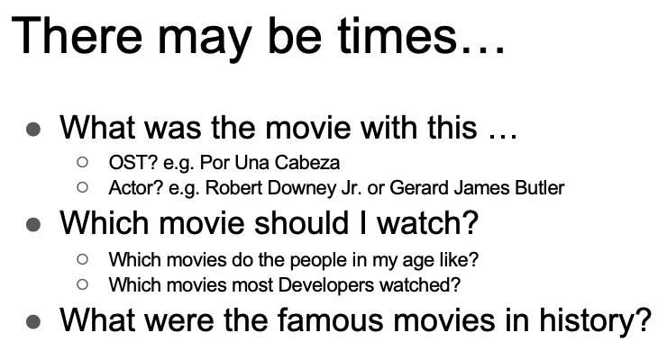
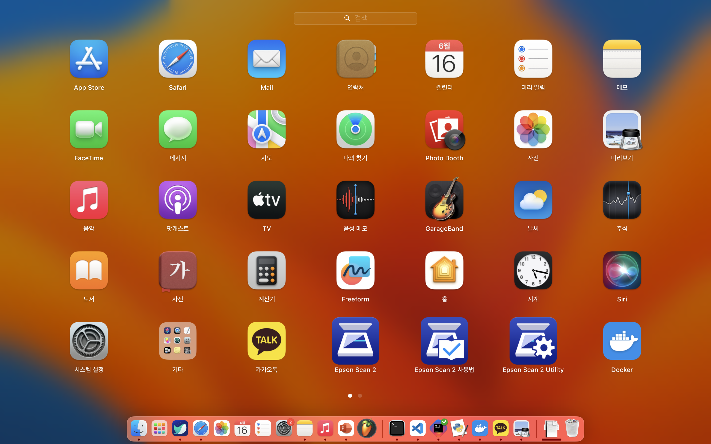

# FreshTomatoes



<!--  {width=600} -->

We present you... **FreshTomatoes**!

A web application with movie services

## Getting Started

These instructions will get you a copy of the project up and running on your local machine for development and testing purposes. See deployment for notes on how to deploy the project on a live system.

### Prerequisites

- Git (https://git-scm.com/book/en/v2/Getting-Started-Installing-Git)
- Docker Desktop (https://www.docker.com/products/docker-desktop/)

### Installing

1. Download our repository. ( `git clone https://github.com/cse364-unist/projects-group3.git` )
2. For running, start up the Docker Desktop.



### Main Web Page


Our main page guides to three features, user can visit each feature's page by clicking the corresponding box.


## Key Features
### Feature1 : *ChatGPT based movie search engine*
#### What is it about?
   Having trouble remembering the title of a movie you want to watch? Just enter what you can remember into our web service, and we'll help you find the movie!

#### How can you use it?
   
   Please enter the information about ***plot, genres, stars, and directors*** of the movie you want to find as much as you remember. If you don't remember, just write "I don't remember". The more detailed information you provide, the higher the chances of accurately finding the movie.

   After you have written everything down, press the **Submit** button and wait a moment. The results will appear below.

#### What does it do?
   
   It will display information about the movie that is most likely the one you're looking for, including the title, year, parental guide, runtime, IMDb rating, genres, plot, director(s), writer(s), and star(s).

   Clicking on the IMDB Link will redirect you to the movie's IMDb page.

#### How does it work?
   
   When you enter plot, genres, stars, and directors into the text box and click the submit button, the ChatController embeds this information into a pre-defined prompt. Then, it sends a request to ChatGPT using the OpenAI API. ChatGPT responds in JSON format. The information is then appropriately displayed on the screen.

   > Note that:
   > 1) AI algorithm is not always correct. ChatGPT's responses can sometimes be **inaccurate**, which means it might not always be able to find the movie you want. In that case, try again with more detailed information.
   > 2) There are some **randomness** in ChatGPT's response. ChatGPT doesn't always output the exact same response.

#### Guiding examples
For example, you may try to input the following:
##### example 1
**Plot:** They save the Earth  
**Genres:** Action  
**Stars:** Chris Evans  
**Directors:** Anthony Russo

##### example 2
**Plot:** Red guy kill many people  
**Genres:** Action, Comic  
**Stars:** Ryan Reynolds  
**Directors:** I don't remember

##### example 3
**Plot:** The ship sinks into the sea  
**Genres:** Drama, Romance  
**Stars:** Leonardo Dicaprio  
**Directors:** James Cameron

#### GET RestAPI /chat
The user provides the plot, genres, stars, and directors as query parameters, and the ChatGPT responds with the information about the movie including the title, year, parental guide, runtime and so on in JSON format.

Example:
- `curl "http://localhost:8080/chat?plot=The%20ship%20sinks%20to%20the%20ocean&genres=Drama,%20Romance&stars=Leonardo%20Dicap
rio&directors=James%20Cameron"`

Expected output:
- `{"title": "Titanic", "imdb_link": "https://www.imdb.com/title/tt0120338/", "year": 1997, "parental_guide": "PG-13", "runtime": "195 min", "imdb_rating": 7.9, "genres": ["Drama", "Romance"], "plot": "A seventeen-year-old aristocrat falls in love with a kind but poor artist aboard the luxurious, ill-fated R.M.S. Titanic.", "director": ["James Cameron"], "writers": ["James Cameron"], "stars": ["Leonardo DiCaprio", "Kate Winslet", "Billy Zane"]}`


### Feature2: *Movie Timeline Visualization*
#### 2.1. Function
This feature supplies 2 visualization about the movie genres and movies in the perspective of time. The first visualization shows the timeline of genre popularities(represented by number of movies) in a form of streamgraph, and the second visualization shows the popularity(represented by number of ratings) comparison of different movies released in the same year. User can search the genre name or movie titles in each visualization tools' search box, and see interactive graphs.

#### 2.2. Usage
##### Example Images


##### Initial Loading
It takes 10-20 seconds to load the visualization tool at the initial web deployment. After loading, user can access to the visualization tool directly even if they visit other pages for feature1 or 3 and come back again.

##### Movie Genre Timeline
In the first visualization, at default, it shows overall number of movies in various genres along time. Here, user can put mouse over the streamgraph and check the corresponding genre names.
And if user want to see the timeline of certain movie genres, user can search for that genre name in the search box.
Here, user should type the first letter to be capital letter. Then the recommended matching genree names appear, and user can click it and modify their search queries. After finishing the typing of certain movie genre, user should click the "Search Genre" button to see the regarding timeline. And user can come back to the initial timeline by clicking green "Initialize" button.
The third image at the above (left part) shows the result of searched genre "Documentary".

##### Movies In The Year
In the second visualization, at default, it shows movie list in bar graph that is sorted according to each movies' number of reviews (released in 1970). 
And if user want to compare certain movies other movies that released in the same year, user can search for that movie title in the search box.
Here, user should also type the first letter to be capital letter. Then the recommend matching movie titles appear, and user can click it and modify their search queries. After finishing the typing of certain movie title, user should click the "Search Movie" button to see the regarding comparison (bar graph). And user can come back to the initial bar graph (movies released in 1970) by clicking green "Initialize" button.
And user can check the information of each bar (representing each movie) by putting the mouse over, about Title, Number of reviews, Genre (3 informations).
The third image at the aboe (right part) shows the result of searched movie "Lord of the Ring, The (1978)".

   > Note that:
   > 1) It takes time for loading at first web deployment.
   > 2) For searching queries, it is limited to the recommended matching keywords when user type each letters in the search box. This data is bounded to our MovieLens database that we utilized for feature1 and 2.


### Feature3: *Recommendation via User Information*

#### 3.1. Function

Basically, given website user information, it recommends movies based on the ratings of similar people.

#### 3.2. Usage

##### 3.2.1. Input
1. Access http://localhost:8080/rec
2. Input the gender, age, and occupation of a person.

##### 3.2.2. Output
The list of movies with links to the duckduckgo search result pops up, ordered in the way that the prior ones are recommended. Specifically,

 1. Average rating (based on the ratings made by the specific type of user): monotonically decreasing
 2. Number of reviews: monotonically decreasing
 3. Title of movie: lexicographically


#### 3.3. Use Cases

- Imagine that you have a girlfriend or a boyfriend (in the future). You can type in the gender, age, and occupation of your lover and watch movies that they likely to have watched and enjoyed. Therefore, you can make a connection with the person via movies.

##### 3.3.1. Example Usage Demonstration

Assume that you have a girlfriend with the following information:

	Yuri.
	Female, 26, Founder of tomato.org

Then, you can use this website to guess which movie she likes.

You type in the gender, age, and occupation information like this:


then you can see the list of movies recommended like this:


With this, you can watch the movies `about Time`, `Equilibrium`, and `Cute Bear` and can make a connection with her later. If she didn’t watch it, you could ask for watching it together! :3

#### 3.4. REST APIs

For this feature, there is only one REST API: recByUser.

```java
@GetMapping(value = "user", params = {"gender", "age", "occ"})
public ResponseEntity<?> recByUser(
      @RequestParam("gender") String gender,
      @RequestParam(value = "age", required = true) Long age,
      @RequestParam("occ") Long occ)
```

Given user information, this method gives the user a list of movies sorted in a way that the prior movie is more recommended.

To be specific, the INPUT and OUTPUT are as follows:

- INPUT: information of the user (age, gender, and occupation).
- OUTPUT: List of the movies rated by the users with the same attributes, sorted in such order:

(Consider the previous criteria superior to the following criteria)

#### 3.5. Example curl commands

- `curl "http://localhost:8080/recommend/user?gender=F&age=18&occ=20"`
 - Output: 1483 of movie data sorted.
- `curl "http://localhost:8080/recommend/user?gender=M&age=18&occ=13"`
 - Output: []. That's because there are no such user rating information.
- `curl "http://localhost:8080/recommend/user?gender=a&age=18&occ=20"`
 - Output: BAD_REQUEST response (invalid gender)
- `curl "http://localhost:8080/recommend/user?gender=F&age=18&occ=21`
 - Output: BAD_REQUEST response (invalid occupation)

## Deployment

Add additional notes about how to deploy this on a live system

## Built With

<!-- * [Dropwizard](http://www.dropwizard.io/1.0.2/docs/) - The web framework used -->
* [Maven](https://maven.apache.org/) - Dependency Management
<!-- * [ROME](https://rometools.github.io/rome/) - Used to generate RSS Feeds -->

<!-- ## Contributing

Please read [CONTRIBUTING.md](https://gist.github.com/PurpleBooth/b24679402957c63ec426) for details on our code of conduct, and the process for submitting pull requests to us.

## Versioning

We use [SemVer](http://semver.org/) for versioning. For the versions available, see the [tags on this repository](https://github.com/your/project/tags).  -->

## Authors
* **Chaeeun Moon** - *Manage Feature 2* - [calculus0129](https://github.com/calculus0129)

* **Jaehyun Bhang** - *Manage Feature 3 and the main Java Applications* - [calculus0129](https://github.com/calculus0129)

<!-- See also the list of [contributors](https://github.com/your/project/contributors) who participated in this project. -->

<!-- ## License

This project is licensed under the MIT License - see the [LICENSE.md](LICENSE.md) file for details -->

## Acknowledgments

* README.md layout by PurpleBooth (https://gist.github.com/PurpleBooth/109311bb0361f32d87a2)
